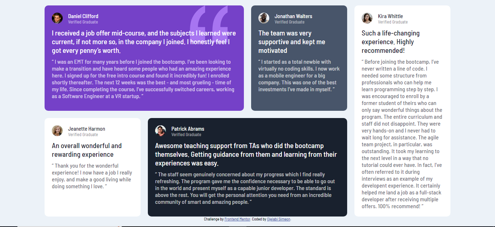

# Frontend Mentor - Testimonials grid section solution

This is a solution to the [Testimonials grid section challenge on Frontend Mentor](https://www.frontendmentor.io/challenges/testimonials-grid-section-Nnw6J7Un7). Frontend Mentor challenges help you improve your coding skills by building realistic projects. 

## Table of contents

- [Overview](#overview)
  - [The challenge](#the-challenge)
  - [Screenshot](#screenshot)
  - [Links](#links)
- [My process](#my-process)
  - [Built with](#built-with)
  - [What I learned](#what-i-learned)
  - [Useful resources](#useful-resources)
- [Author](#author)


## Overview

### The challenge

Users should be able to:

- View the optimal layout for the site depending on their device's screen size

### Screenshot




### Links

- Solution URL: [GitHub Repo](https://github.com/NobleSimeon/-Group-of-Projects.)
- Live Site URL: [CodePen](https://codepen.io/Noble-Simeon/full/wvEaXJM)

## My process

### Built with

- Semantic HTML5 markup
- CSS custom properties
- Flexbox
- CSS Grid
- Mobile-first workflow


### What I learned

I learnt the power of grid


```html
```
```css
main {
    width: min(95%, 70rem);
    display: grid;
    gap: 20px;
    grid-auto-columns: 1fr;
    grid-template-areas: 
    "one"
    "two"
    "three"
    "four"
    "five";
}
```
```js

```


### Useful resources

- [Learn grid the easy way](https://www.youtube.com/watch?v=rg7Fvvl3taU) - This helped because it helped understand grid better. I'd recommend it to anyone still learning this concept.


## Author

- Website - [Ojelabi Simeon](https://github.com/NobleSimeon)
- Frontend Mentor - [@NobleSimeon](https://www.frontendmentor.io/profile/NobleSimeon)
- Twitter - [@SimeonPelumi](https://www.twitter.com/SimeonPelumi)


